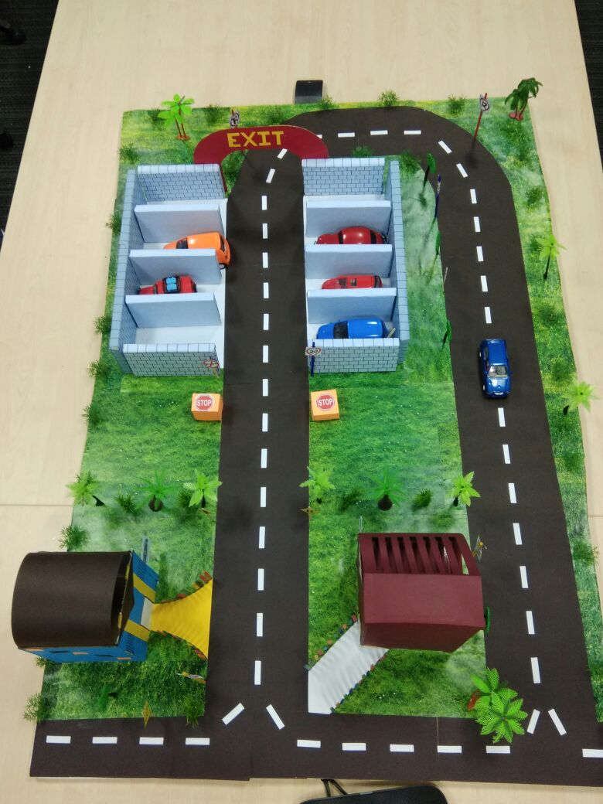
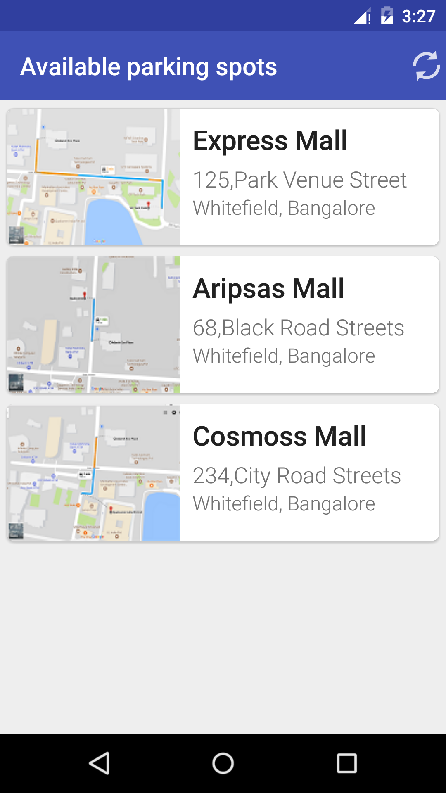
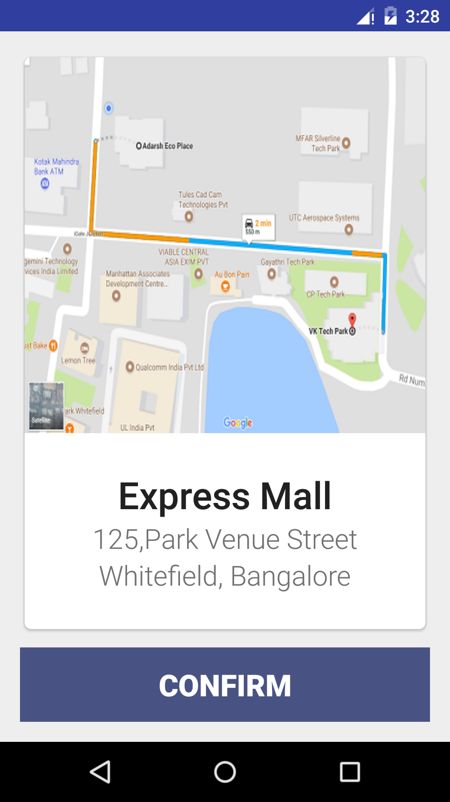
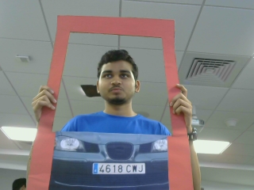
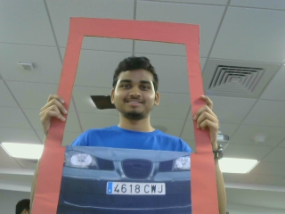
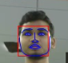
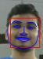
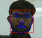
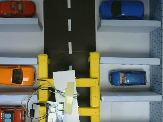
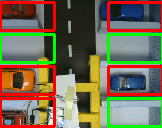

# WannaPark - Your Personal Parking Buddy 
 A Real-time car parking system model using Deep learning applied on CCTV camera images, 
 developed for the competition IdeaQuest, held among the summer interns of Qualcomm. 
 We also propose a novel method for internal navigation and prevention of Car thefts (all details are not
 released yet).
 
  

 ## Description
 - `android` - Contains the code for the Android App for WannaPark and a utility scanner app.
  <p align = "center">
 
 &nbsp; &nbsp; &nbsp;
 
 &nbsp; &nbsp; &nbsp;
 
 </p>
 
 
 - `face_comparison` - Contains the code to implement face comparison using Histogram of Gradients (HOG) 
 for extracting the faces from the 2 images, Pose estimation to align the extracted face images as close to the center 
 as possible and finally, using the VGGNet-16 (with `weights=imagenet`) as a feature extractor for the two images.
 The similarity comparison is done by calculating the euclidean distance between the extracted features of the two images.
 Compare different images using images placed in `images/test_images`. <br>
 
 <p align = "center">
 <b> Input Entry</b>
 &nbsp; &nbsp; &nbsp;
 <b>Input Exit</b>
 </p>
 <p align = "center">
 
 &nbsp; &nbsp; &nbsp;
 
 </p>
 <p align = "center">
 <b> Output Entry</b>
 &nbsp; &nbsp; &nbsp;
 <b>Output Exit</b>
 </p>
 <p align = "center">
 
 &nbsp; &nbsp; &nbsp;
 
 </p>
 
 ```python
Distance: 11.616581
```

 <p align = "center">
 <b> Input Entry</b>
 &nbsp; &nbsp; &nbsp;
 <b>Input Exit</b>
 </p>
 <p align = "center">
 
 &nbsp; &nbsp; &nbsp;
 
 </p>
 <p align = "center">
 <b> Output Entry</b>
 &nbsp; &nbsp; &nbsp;
 <b>Output Exit</b>
 </p>
 <p align = "center">
 
 &nbsp; &nbsp; &nbsp;
 
 </p>

```python
Distance: 25.926846
```
 
 - `images` - Contains the various images used.
    - `final_detection` - Contains the image for parking lot vacancy detection.
    - `final_entry` - Contains the image considered as the one during entry in the parking lot.
    - `final_exit` - Contains the image considered as the one during exit from the parking lot.
    - `test_images` - Contains images which can be used for seeing different results (Don't forget to 
    change the extension of file names to .jpg).
 
 - `parking_lot_detection` - Contains the code to implement parking lot vacancy detection. It uses the PKLot dataset for training 
 where each image is of size 54x32. It uses the pre-trained convolutional layers from VGGNet-F (As this is the only version of
 VGGNet which would work with images of dimension 54x32) and then fine-tunes the dense layer for the required task. It achieved
 an accuracy of ~ 94%. Details on using the code are present in the folder. <br>
 <p align = "center">
 <b> Input</b>
 &nbsp; &nbsp; &nbsp;
 <b>Output</b>
 </p>
 <p align = "center">
 
 &nbsp; &nbsp; &nbsp;
 
 </p>
 
  - `server` - Contains the server side code implemented in Python which connects the Android Application, a scanner app, the `face_comparison` module and the `parking_lot_detection` module. 
 
 We used [neuralPlateRecognition](https://github.com/niloxx/neuralPlateRecognition) for Number plate extraction from the image.
 
 ## Contributors
 - [Aman Dalmia](https://github.com/dalmia) (`face_comparison`, `parking_lot_detection`)
 - [Sourav Das](https://www.facebook.com/sourav.das.3557) (`server`)
 
